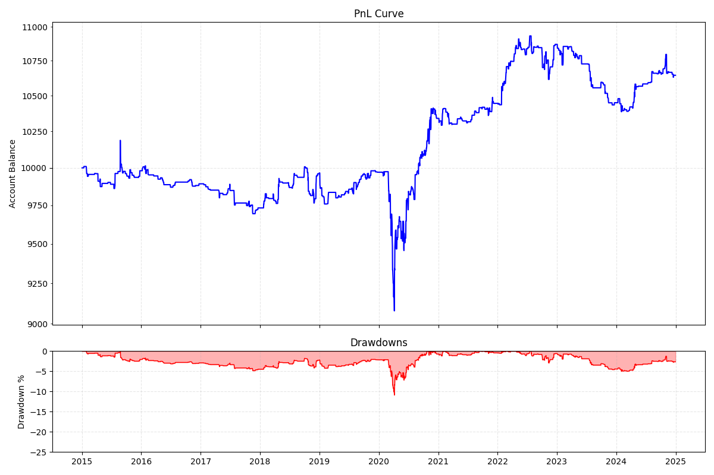

# bagtester

## Project Overview

bagtester is a backtesting engine for stock and crypto trading strategies, written in Python. It simulates trading strategies bar by bar using historical OHLCV data. Custom strategies are built by subclassing the `Strategy` base class. The engine supports market, limit, and stop orders with TP/SL child orders, order lifetimes, multi-asset portfolios, margin/liquidation mechanics, and produces equity curves with performance metrics.

### Example Output Plot



## Features

- Bar-by-bar simulation engine
- `Strategy` base class for subclassing and two example strategies
- Multi-asset simulation with concurrent positions
- Market, limit, and stop order types
- Bracket orders via TP/SL child orders
- Order lifetimes with delayed order activation
- Margin and liquidation mechanics
- Simplified flat-percentage costs: transaction fees (commission or maker/taker), slippage, margin interest, and asset borrow fees
- Basic Matplotlib-based analytics (equity curve, drawdown, CAGR)
- Sample dataset with daily OHLCV data for 20 stocks

## Setup & Run

### Requirements

- Python 3.14
- pip

### Linux / macOS

```bash
git clone https://github.com/lnickolay/bagtester.git
cd bagtester

python3 -m venv .venv
source .venv/bin/activate

pip install -r requirements.txt
python src/main.py
```

### Windows

```bash
git clone https://github.com/lnickolay/bagtester.git
cd bagtester

py -3.14 -m venv .venv
.venv\Scripts\activate

pip install -r requirements.txt
python src/main.py
```

## Dependencies

- Python 3.14
- matplotlib, mplfinance, numpy, pandas, yfinance

## Status

Under active development.

## License

This project is licensed under the MIT License - see the `LICENSE.md` file for details.
